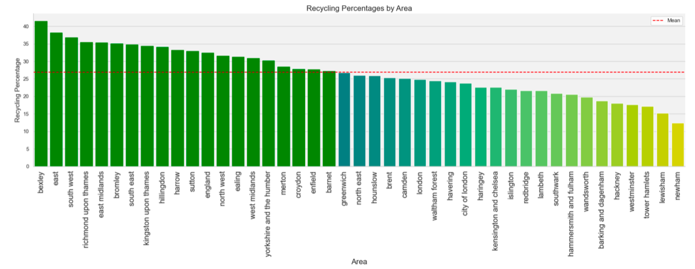

# Notebook Insights

## London Housing Market Analysis

### Key Takeaways

- COVID-19 caused a sharp decline in recycling rates in 2020 due to disruptions and increased single-use product waste during lockdowns.

- After London won gold in the Environmental and Sustainability awards in Olympic Games, a decrease in financial and political support for recycling projects might have impacted the recycling rates.

