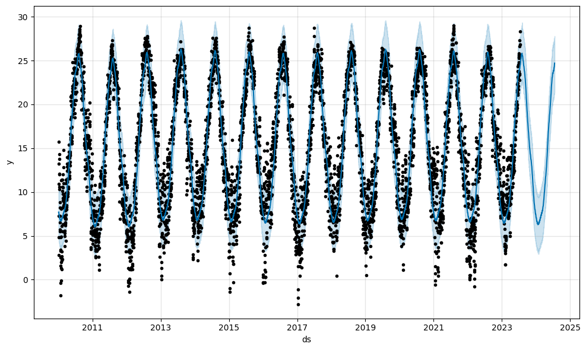

# Notebook Insights

## London Housing Market Analysis

### Key Takeaway

- After London won gold in the 2012 Environmental and Sustainability awards in Olympic Games, a decrease in financial and political support for recycling projects might have impacted.

***

## Classification: Income Prediction Based on Demographic and Socioeconomic Factors

### Key Takeaway

- Accuracy: 0.8524

- The overall accuracy of the model is approximately 85.24%. It indicates the proportion of correctly classified instances. A higher value suggests better performance.

***

## Time Series: Analyzing Weather Data from Open-Meteo API

### Key Takeaway

- On July 20, 2024, the hottest day will be recorded with a maximum average temperature of 29.6°C, considering both day and night temperatures.

<<<<<<< HEAD

***

## Calorie Prediction Through Nutritionals

### Key Takeaway

- The calorie prediction model demonstrates a robust fit to the data, with an impressive R2 value of 0.91, explaining about 91% of the variance in the target variable (calories). Moreover, it accurately predicts the calorie value for the Apple Pie test data, yielding an estimate of 287.93 calories.

=======
>>>>>>> 5162b89570cb118bbda20c2f76856903c7198cf4
